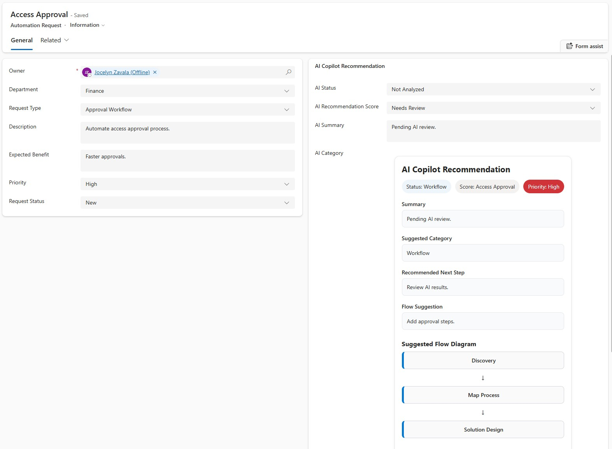
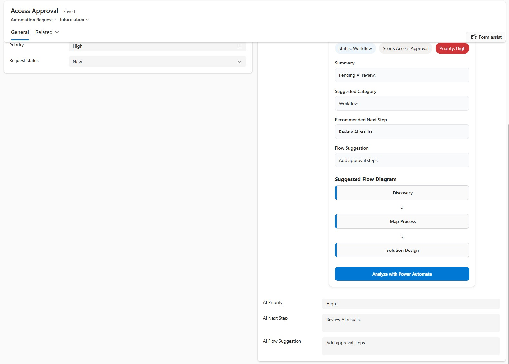

# AI Workflow Recommendation Panel (PCF)

Custom Power Apps Component Framework (PCF) control built for a Dataverse model-driven application to display AI-driven automation recommendations inside an Automation Request form.

---

## Screenshots

### AI Recommendation Panel (PCF)



### Dataverse Form Integration



---

## Overview

This project demonstrates a custom PCF control that enhances Dataverse records with intelligent recommendations including:

- AI Status
- AI Recommendation Score
- AI Summary
- Suggested Category
- Recommended Next Step
- Flow Suggestion
- Dynamic Flow Diagram

---

## Features

### AI Recommendation Panel
Displays structured AI recommendations directly inside a model-driven form.

### Dynamic Flow Logic

Request types supported:

- Approval Workflow
- Notification
- Reporting
- Integration
- Document Management

Example Flow:

Trigger  
↓  
Manager Approval  
↓  
Conditional Outcome  
↓  
Update Status

---

## Tech Stack

- Power Apps Component Framework (PCF)
- TypeScript
- React
- Dataverse
- Model-Driven Apps
- Power Platform CLI

---

## Dataverse Fields Used

- AI Status  
- AI Recommendation Score  
- AI Summary  
- AI Category  
- AI Priority  
- AI Next Step  
- AI Flow Suggestion  
- Request Type  

---

## Run Locally

Install dependencies

```bash
npm install
```

Build

```bash
npm run build
```

Run test harness

```bash
npm start
```

---

## Deploy

```bash
pac pcf push --publisher-prefix jz
```

Then add the component to a Dataverse form and map fields.

---

## Future Enhancements

Planned:

- AI API integration
- Copilot-generated workflow suggestions
- Power Automate flow generation
- Export flow as JSON
- Advanced reusable PCF control

---

## Author

Jocelyn Zavala Fara

Microsoft 365 | SharePoint | Power Platform | SPFx | Dataverse
